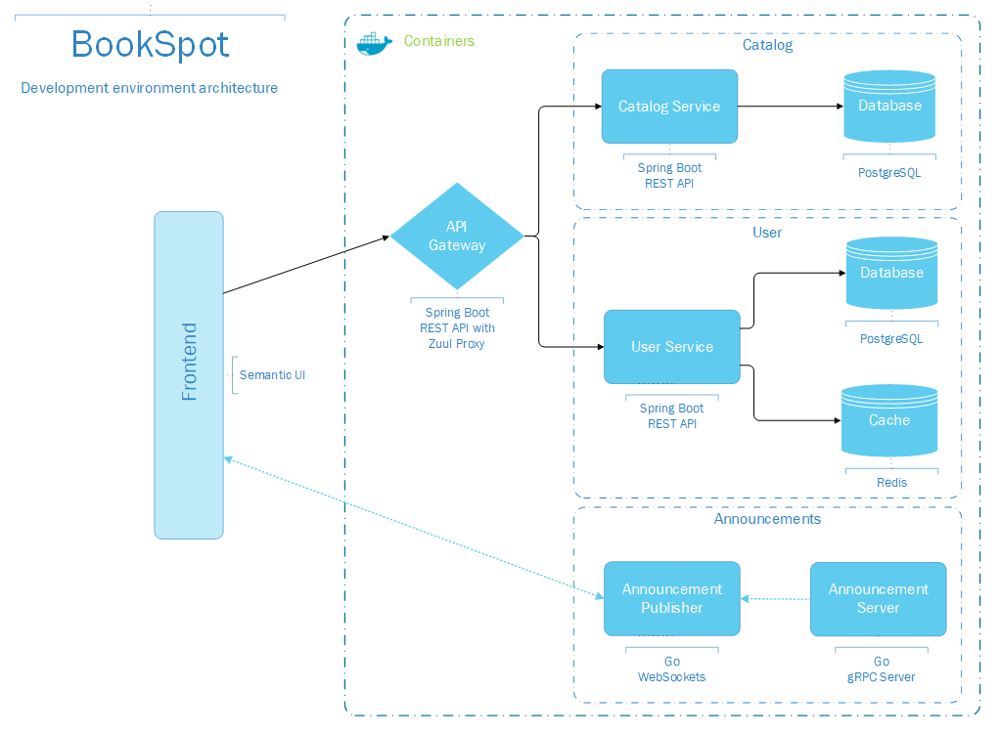

[](https://jenkins.book-spot.club/job/book-spot/job/develop/)


## About

BookSpot is a microservices demo application. It is a web-based book rating app.

The aim of this project is to showcase how we can setup a local development environment when working with microservices, since the hurdles of replicating a diverse production stack can be many.

## Services

| Name                 | Description                                                             |
| -------------------- | ----------------------------------------------------------------------- |
| [gateway](./gateway) | Acts as an API gateway that routes requests to downstream services      |
| [catalog](./catalog) | Provides CRUD endpoints for all available books                         |
| [user](./user)       | Provides CRUD endpoints for users along with login session              |
| [announcement-server](./announcement/server) | Generates (fake) announcement events            |
| [announcement-publisher](./announcement/publisher) | Listens for announcements and publishes them to connected clients |


### Build with
Various technologies/frameworks were used in order to speed development and, happily, all of them are open-source:

* [Spring Boot](https://github.com/spring-projects/spring-boot) - *Catalog*, *user* and *gateway* use Spring Boot, a popular Java framework, along with many of its plugins, such as Spring Data JPA/REST/Redis.
* [PostgresSQL](https://www.postgresql.org/) - Postgres is the RDBMS used for persistent storage by both *catalog* and *user*.
* [Redis](https://github.com/antirez/redis) - In-memory database serving as caching layer. Also used for storing login session info.
* [Zuul](https://github.com/Netflix/zuul) - *Gateway* uses Netflix's Zuul as a gateway proxy.
* [Gorilla](https://github.com/gorilla/websocket) - *Announcement-publisher* utilizes gorilla to provide a WebSockets server, written in Go.
* [gRPC-Go](https://github.com/grpc/grpc-go) - *Announcement-server* uses this library as a gRPC server and *publisher* as a gRPC client. 
* [Faker](https://github.com/bxcodec/faker) - Fake data generator, used by *announcement-server*, written in Go.

All Java services were developed in [IntelliJ IDEA Ultimate Edition](https://www.jetbrains.com/idea/) (2019.3.3) (Educational license).

All Go services were developed in [VS Code](https://github.com/Microsoft/vscode/).

Last but not least, HTML/CSS/JS & [Semantic UI](https://github.com/Semantic-Org/Semantic-UI) were used for frontend development.

The following diagram shows how all these fit together:



### How to run
In order to avoid problems from different local configurations/runtimes, all services can run on docker containers. For convenience, various docker-compose configurations were created:
- **docker-compose.yml**: Starts only Postgres and Redis, useful for everyday development, where you work and test individual services.
- **docker-compose.dev.yml**: Starts all services using the local build context, useful for checking how the whole system works locally.
- **docker-compose.all.yml**: Starts all services, by pulling pre-built images from Docker Hub.
 
So, assuming you are in the project's root directory you can start the system by executing:
```sh
docker-compose -f docker-compose.all.yml up
```
All things well, you can verify that the application runs at:
```sh
127.0.0.1:8080
```

To stop press Ctrl+C or run
```sh
docker-compose -f docker-compose.all.yml stop
```

replace *stop* with *down* to destroy all containers, images etc.

##### Note

This project is part of my MSc thesis.